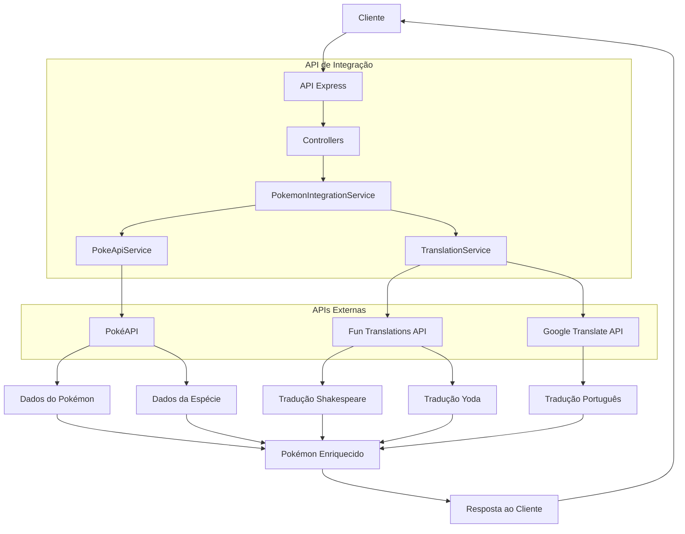
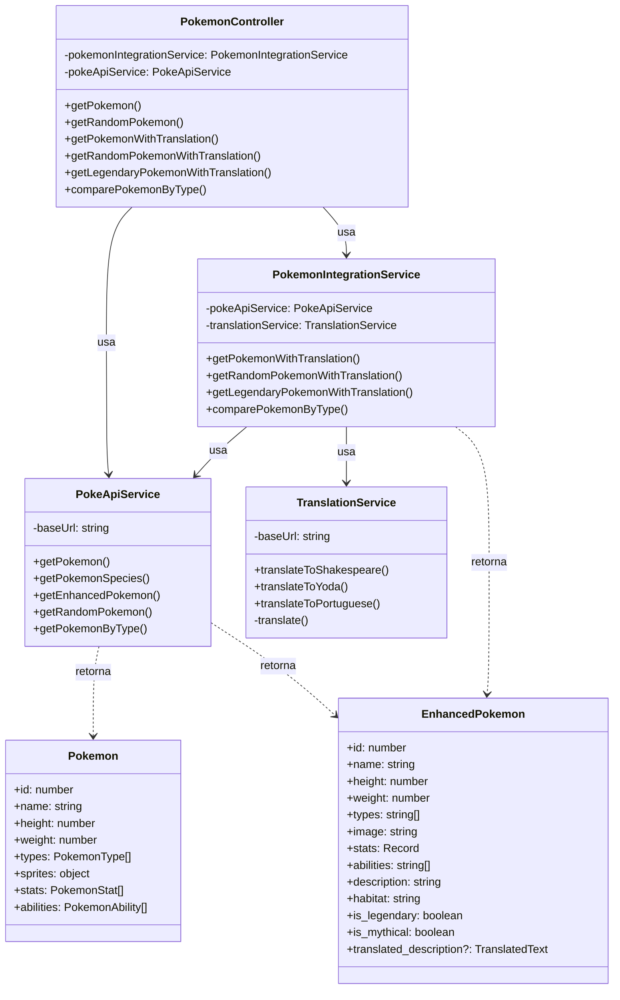
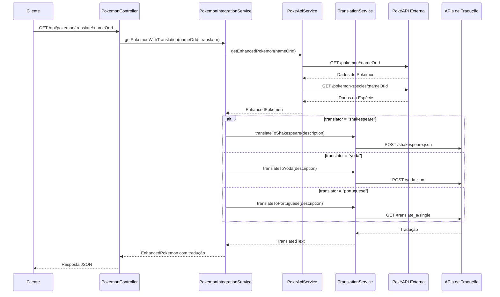
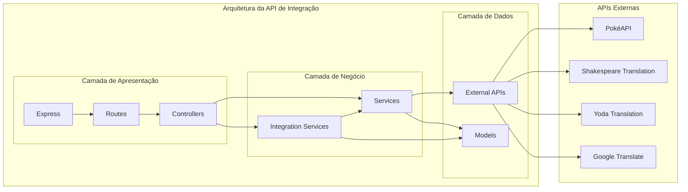

# Diagramas da API de Integração Pokémon

Este documento apresenta os diagramas que ilustram a arquitetura, o fluxo de dados e a interação entre as APIs no sistema de integração Pokémon.

## 1. Fluxo de Dados

O diagrama abaixo ilustra como os dados fluem através do sistema:

### Explicação do Fluxo de Dados:

1. O cliente faz uma requisição à API Express
2. A requisição passa pelos controladores que coordenam as operações
3. O serviço de integração orquestra as chamadas às APIs externas:
   - O PokeApiService obtém dados da PokéAPI
   - O TranslationService obtém traduções das APIs de tradução
4. Os dados são combinados em um objeto EnhancedPokemon
5. A resposta é enviada de volta ao cliente

## 2. Diagrama de Classes

O diagrama abaixo mostra a estrutura de classes e suas relações:

### Explicação do Diagrama de Classes:

- **PokemonController**: Gerencia as requisições HTTP e coordena os serviços
- **PokemonIntegrationService**: Orquestra a integração entre os diferentes serviços
- **PokeApiService**: Responsável pela comunicação com a PokéAPI
- **TranslationService**: Gerencia as traduções em diferentes estilos
- **Modelos de dados**: 
  - **Pokemon**: Representa os dados brutos recebidos da PokéAPI
  - **EnhancedPokemon**: Representa os dados processados e enriquecidos com traduções

## 3. Diagrama de Sequência

O diagrama abaixo detalha a sequência de chamadas para obter um Pokémon com tradução:

### Explicação do Diagrama de Sequência:

1. O cliente solicita um Pokémon com tradução através do endpoint `/api/pokemon/translate/:nameOrId`
2. O controlador delega ao serviço de integração
3. O serviço de integração obtém os dados do Pokémon através do PokeApiService
4. O PokeApiService faz duas chamadas à PokéAPI:
   - Uma para obter os dados básicos do Pokémon
   - Outra para obter os dados da espécie, incluindo a descrição
5. Com base no tipo de tradução solicitada (Shakespeare, Yoda ou português), o serviço de tradução apropriado é chamado
6. Os dados traduzidos são combinados com os dados do Pokémon
7. A resposta completa é retornada ao cliente

## 4. Arquitetura em Camadas

O diagrama abaixo apresenta a arquitetura em camadas do sistema:

### Explicação da Arquitetura em Camadas:

- **Camada de Apresentação**: 
  - Express: Framework web para Node.js
  - Routes: Define os endpoints da API
  - Controllers: Gerencia as requisições HTTP e coordena os serviços

- **Camada de Negócio**: 
  - Services: Implementa a lógica de negócio para cada domínio (Pokémon, Traduções)
  - Integration Services: Orquestra a integração entre diferentes serviços

- **Camada de Dados**: 
  - Models: Define as estruturas de dados utilizadas na aplicação
  - External APIs: Abstrai a comunicação com APIs externas

Esta arquitetura segue o padrão MVC (Model-View-Controller) adaptado para APIs, com uma clara separação de responsabilidades entre as camadas.

## Interação entre APIs

A API de integração interage com três APIs externas:

1. **PokéAPI** (https://pokeapi.co/api/v2):
   - `/pokemon/:nameOrId`: Dados básicos do Pokémon (estatísticas, tipos, habilidades)
   - `/pokemon-species/:nameOrId`: Dados da espécie (descrições, habitat, classificação)
   - `/type/:type`: Informações sobre Pokémon de um tipo específico

2. **Fun Translations API** (https://api.funtranslations.com/translate):
   - `/shakespeare.json`: Traduz para o estilo Shakespeare
   - `/yoda.json`: Traduz para o estilo Yoda

3. **Google Translate API** (https://translate.googleapis.com):
   - `/translate_a/single`: Traduz de inglês para português

Esta arquitetura modular permite adicionar facilmente novos serviços de tradução ou novas fontes de dados sem afetar o restante do sistema.

## Conclusão

Os diagramas apresentados ilustram a arquitetura completa do sistema de integração Pokémon, demonstrando como diferentes APIs são combinadas para criar um serviço com valor agregado. A estrutura modular e a clara separação de responsabilidades facilitam a manutenção e a extensão do sistema.
