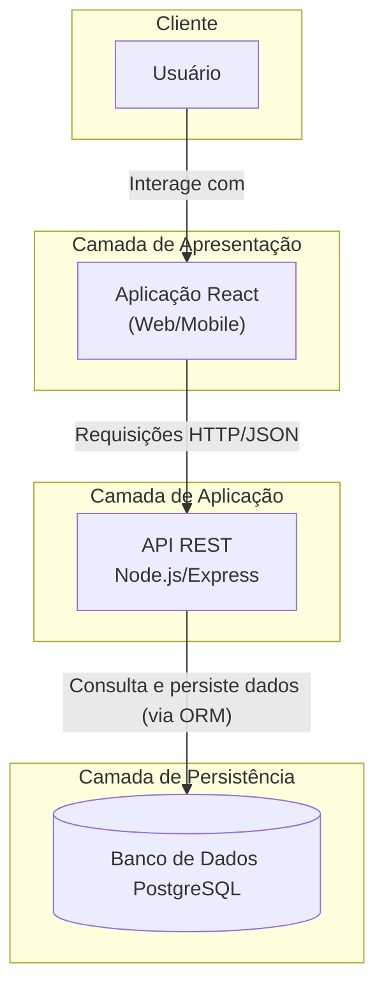

# API de Biblioteca comunitária 

Essa API permite gerenciar de forma digital os recursos de uma biblioteca comunitária. Ela oferece funcionalidades para cadastrar, consultar, atualizar e remover livros, bem como gerenciar usuários, empréstimos e devoluções. O objetivo é facilitar a organização 
do acervo, acompanhar o histórico de empréstimos e disponibilizar informações de forma rápida e acessível para a comunidade.

## Problema abordado e justificativa

Muitas bibliotecas comunitárias enfrentam dificuldades para gerenciar livros, empréstimos e eventos culturais de forma eficiente.           O problema, portanto, é a ineficiência na gestão de recursos e informações em bibliotecas comunitárias, afetando a experiência de       leitores e a organização interna. 
A escolha do tema se justifica pela importância da leitura e cultura na formação educacional e social, especialmente em bairros com menor acesso a recursos educativos.
* O sistema digital de gerenciamento permite automatizar processos, tornando o registro de empréstimos e livros mais confiável.
* Facilita o acesso dos usuários a informações sobre livros disponíveis e eventos.
* Contribui para inclusão digital e incentivo à leitura, fortalecendo o papel da biblioteca na comunidade.

Este projeto busca resolver esse problema, gerando um impacto social positivo alinhado ao
ODS 4 – Educação de Qualidade
Garantir educação inclusiva, equitativa e de qualidade, e promover oportunidades de aprendizagem ao longo da vida para todos.
ODS 11 – Cidades e Comunidades Sustentáveis
Tornar as cidades e os assentamentos humanos inclusivos, seguros, resilientes e sustentáveis.

## Objetivo do Sistema

### Geral: 

* Desenvolver uma solução de software para otimizar a gestão de bibliotecas comunitárias, promovendo a leitura e a participação cultural.

### Específicos:

* Automatizar o cadastro e a consulta de livros.

* Digitalizar o processo de empréstimos e devoluções.

* Facilitar a gestão de usuários (leitores e administradores).

* Gerar relatórios básicos para apoiar a tomada de decisão.

## Escopo do Projeto 

1. Visão Geral
O projeto visa desenvolver um sistema digital de gerenciamento de bibliotecas comunitárias, permitindo que bibliotecários e usuários tenham acesso facilitado a livros, empréstimos, eventos culturais e relatórios de uso. O sistema será acessível via web e dispositivos móveis.

 ## Levantamento e Organização das Funcionalidades

* Cadastro, atualização e consulta de usuários (leitores e administradores).
* Registro e controle de empréstimos e devoluções de livros.
* Consulta de livros disponíveis, com filtros por título, autor e categoria.
* Cadastro, divulgação e participação em eventos culturais.
* Geração de relatórios e estatísticas sobre livros, usuários, empréstimos e participação em eventos.

 ## Definição da Arquitetura

* Backend baseado em API RESTful para servir os dados de usuários, livros, empréstimos e eventos.
* Frontend web responsivo, com design de interface para dispositivos móveis.
* Banco de dados relacional (PostgreSQL) para persistência dos dados e controle de integridade.

 ## Modelagem de Dados e APIs

* Criação de diagrama ER representando usuários, livros, empréstimos e eventos culturais.
* Especificação dos endpoints da API, incluindo métodos, parâmetros de requisição e formatos de resposta (JSON).

 ## Prototipação de Interfaces

* Desenvolvimento de protótipos de interface para web e mobile.
* Validação dos fluxos de usuário com base no Design Centrado no Usuário (UCD).

## Planejamento da Implementação (Etapa 2)

* Cronograma detalhado para o desenvolvimento do backend, frontend, integração e testes.
* Estratégia de testes: unitários, de integração, funcionais e de carga.

## Fora de Escopo nesta Etapa

* Implementação de código.
* Hospedagem em produção.
* Integração contínua e deployment automatizado.

Esses itens serão tratados na etapa seguinte do projeto, quando o desenvolvimento e testes práticos forem iniciados.

 ## Visão Geral da Arquitetura

 O sistema de gerenciamento de bibliotecas comunitárias será baseado em uma arquitetura cliente-servidor em três camadas, garantindo escalabilidade, manutenção facilitada e segurança dos dados.

### Camadas do Sistema
 1. Frontend (Interface do Usuário)
  * Desenvolvido em React, com interface web responsiva e compatível com dispositivos móveis.
  * Responsável por apresentar dados, interagir com o usuário e consumir as APIs do backend via Axios.
  * Fornece funcionalidades como: busca de livros, cadastro de usuários, registro de empréstimos, consulta a eventos e relatórios.

 2.  Backend (Camada de Aplicação)
  * Desenvolvido em Node.js com Express.js, atuando como API RESTful.
      Responsável por:
       * Processar requisições dos clientes.
       * Aplicar regras de negócio (ex.: controle de empréstimos e devoluções).
       * Gerenciar autenticação e autorização via JWT.
       * Garantir integridade dos dados e comunicação segura com o banco de dados.

3. Banco de Dados (Camada de Persistência)

  * Implementado em PostgreSQL com uso de ORM (Sequelize ou Prisma).
  * Armazena dados de usuários, livros, empréstimos, eventos culturais e participação.
  * Permite consultas rápidas, integridade referencial e relatórios confiáveis.

### Diagrama de Arquitetura

## Tecnologias Propostas

* Frontend: React, Axios, TailwindCSS 
* Backend: Node.js, Express.js, JWT (autenticação) 
* Banco de Dados: PostgreSQL
* Prototipação: Figma

## Cronograma para Etapa 2 (N708):

No primeiro mês, o foco será no setup e no desenvolvimento do backend. Nas duas primeiras semanas, a equipe irá configurar o ambiente de desenvolvimento e a estrutura do projeto, iniciando a criação dos endpoints de autenticação e usuários. Nas duas semanas seguintes, o trabalho no backend continuará com a implementação das APIs para a gestão de livros, empréstimos e eventos.

O segundo mês será dedicado ao desenvolvimento do frontend. As semanas cinco e seis serão utilizadas para criar as telas de login, cadastro e perfil de usuário. Logo após, entre as semanas sete e oito, o foco será a implementação das interfaces principais do sistema, como as telas para visualização e cadastro de livros, empréstimos e eventos.

No terceiro e último mês, as atividades se concentrarão na integração, testes e finalização. Durante as semanas nove e dez, o frontend será conectado às APIs do backend e serão iniciados os testes de integração. As duas últimas semanas serão reservadas para a realização de testes completos, ajustes finais de usabilidade e a preparação do projeto para a apresentação final da disciplina.

## Integrantes da Equipe

Daniel Alves Fabrício (Matrícula: 2326208) - Gerente de Projeto e Arquiteto de Software

Francisco Eduardo Nogueira Nobre (Matrícula: 2326181) - Desenvolvedor Backend

Ayala Rodrigues Freire (Matrícula: 2323803) - Desenvolvedora Backend

Manuela Rocha Trigueiro Asfor (Matrícula: 2316545) - Desenvolvedora Frontend e UI/UX Designer

Samara Lima Queiroz (Matrícula: 2325659) - Desenvolvedora Frontend e Analista de QA
